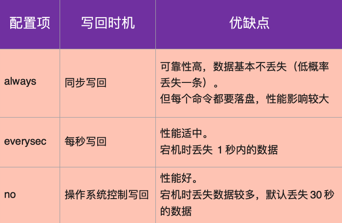

## redis的持久化
快照方式（RDB，Redis DataBase）：将某一个时刻的内存数据，以二进制的方式写入磁盘；
文件追加方式（AOF，Append Only File），记录所有的操作命令，并以文本的形式追加到文件中；
混合持久化方式，Redis 4.0 之后新增的方式，混合持久化是结合了 RDB 和 AOF 的优点，在写入的时候，先把当前的数据以 RDB 的形式写入文件的开头，再将后续的操作命令以 AOF 的格式存入文件，这样既能保证 Redis 重启时的速度，又能减低数据丢失的风险。

## RDB

手动触发

手动触发持久化的操作有两个： save 和 bgsave ，它们主要区别体现在：是否阻塞 Redis 主线程的执行。

1. save 命令
在客户端中执行 save 命令，就会触发 Redis 的持久化，但同时也会使 Redis 处于阻塞状态，直到 RDB 持久化完成，才会响应其他客户端发来的命令，所以在生产环境一定要慎用。

2. bgsave 命令
bgsave（background save）为后台保存， 它和 save 命令最大的区别就是 bgsave 会 fork 一个子进程来执行持久化，整个过程中只有在 fork 子进程时有短暂的阻塞，当子进程被创建之后，Redis 的主进程就可以响应其他客户端的请求了，相对于整个流程都阻塞的 save 命令来说，显然 bgsave 命令更适合我们使用。

2）自动触发

说完手动触发之后，再来看看自动触发，关于自动触发的条件我们是可以在配置文件中进行配置的。

1. save m n

save m n 是指在 m 秒内，如果有 n 个键发生改变，则自动触发持久化。 参数 m 和 n 可以在 Redis 的配置文件中找到，例如，save 60 1 则表明在 60 秒内，只要有一个键发生改变，就会触发 RDB 持久化。 自动触发持久化，本质是 Redis 通过判断，如果满足设置的触发条件，自动执行一次 bgsave 命令。 注意：当设置多个 save m n 命令时，满足任意一个条件都会触发持久化。 例如，我们设置了以下两个 save m n 命令：

save 60 10
save 600 20
当 60s 内如果有 10 次 Redis 键值发生改变，就会触发持久化；如果 60s 内 Redis 的键值改变次数少于 10 次，那么 Redis 就会判断 600s 内，Redis 的键值是否至少被修改了 20 次，如果满足则会触发持久化。

2. flushall

flushall 命令用于清空 Redis 数据库，在生产环境下一定慎用，当 Redis 执行了 flushall 命令之后，则会触发自动持久化，把 RDB 文件清空。

3. 主从同步触发

在 Redis 主从复制中，当从节点执行全量复制操作时，主节点会执行 bgsave 命令，并将 RDB 文件发送给从节点，该过程会自动触发 Redis 持久化。

RDB优缺点
1）RDB 优点

RDB 的内容为二进制的数据，占用内存更小，更紧凑，更适合做为备份文件；
RDB 对灾难恢复非常有用，它是一个紧凑的文件，可以更快的传输到远程服务器进行 Redis 服务恢复；
RDB 可以更大程度的提高 Redis 的运行速度，因为每次持久化时 Redis 主进程都会 fork 一个子进程，进行数据持久化到磁盘，Redis 主进程并不会执行磁盘 I/O 等操作；
与后面介绍的 AOF 格式的文件相比，RDB 文件可以更快的重启。
2）RDB 缺点

因为 RDB 只能保存某个时间间隔的数据，如果中途 Redis 服务被意外终止了，则会丢失一段时间内的 Redis 数据；
RDB 需要经常 fork 才能使用子进程将其持久化在磁盘上。如果数据集很大，fork 可能很耗时，并且如果数据集很大且 CPU 性能不佳，则可能导致在几毫秒甚至一秒钟内 Redis 无法为客户端服务。
当然我们也可以禁用持久化，从而提高 Redis 的执行效率，如果对数据丢失不敏感的情况下，可以在连接客户端的情况下，执行 config set save "" 命令即可禁用 Redis 的持久化。而在 redis.conf 中，如果把 save 开头的那几个配置全给注释掉，那么也会禁止持久化。但一般不会这么做。

## AOF
AOF（Append Only File）指的是追加到文件，所以 AOF 我们可以猜测它应该类似于日志文件一样，事实上也确实如此。但它和我们熟悉的数据库的预写式日志（Write Ahead Log，WAL）不同，WAL 是先把修改的数据记到日志文件中，然后执行相关操作；而 AOF 正好相反，Redis 是先执行命令、将数据写入内存，然后才记录日志。

1）查询 AOF 启动状态
使用 config get appendonly 命令

2）开启 AOF 持久化
Redis 默认是关闭 AOF 持久化的，想要开启 AOF 持久化，有以下两种方式：

通过命令行的方式；
通过修改配置文件的方式（redis.conf）

# 触发持久化
1）自动触发

有两种情况可以自动触发 AOF 持久化，分为是："满足 AOF 设置的持久化策略触发" 和 "满足 AOF 重写触发"。其中，AOF 重写触发会在本文的后半部分详细介绍，这里重点来说 AOF 持久化策略都有哪些。 AOF 持久化策略，分为以下三种：

always：每条 Redis 操作命令都会写入磁盘，最多丢失一条数据；
everysec：每秒钟写入一次磁盘，最多丢失一秒的数据；
no：不设置写入磁盘的规则，根据当前操作系统来决定何时写入磁盘，Linux 默认 30s 写入一次数据至磁盘。

在客户端执行 bgrewriteaof 命令就可以手动触发 AOF 持久化。

和 RDB 持久化类似，RDB 持久化会生成 dump.rdb 文件，AOF 持久化会生成 appendonly.aof 文件。但是注意：在往 AOF 文件中记录日志的时候，是由主线程来完成的，如果在把日志文件写入磁盘时，磁盘写压力大，就会导致写盘很慢，进而导致后续的操作也无法执行了。

AOF 是通过记录 Redis 的执行命令来持久化（保存）数据的，所以 AOF 文件会随着时间变得越来越大，这样不仅增加了服务器的存储压力，也会造成 Redis 重启速度变慢，为了解决这个问题 Redis 提供了 AOF 重写的功能。

# AOF 文件重写
1）什么是AOF重写？

AOF 重写指的是它会直接读取 Redis 服务器当前的状态，并压缩保存为 AOF 文件。例如，我们增加了一个计数器，并对它做了 99 次修改，如果不做 AOF 重写的话，那么持久化文件中就会有 100 条记录执行命令的信息，而 AOF 重写之后，之后记录一条此计数器最终的结果信息，这样就去除了所有的无效信息。

2）AOF重写实现

触发 AOF 文件重写，要满足两个条件，这两个条件也是配置在 Redis 配置文件中的，它们分别是：

auto-aof-rewrite-min-size：允许 AOF 重写的最小文件容量，默认是 64mb。
auto-aof-rewrite-percentage：AOF 文件重写的大小比例，默认值是 100，表示 100%，也就是只有当前 AOF 文件，比最后一次（上次）的 AOF 文件大一倍时，才会启动 AOF 文件重写。

持久化文件加载规则

如果只开启了 AOF 持久化，Redis 启动时只会加载 AOF 文件（appendonly.aof），进行数据恢复；
如果只开启了 RDB 持久化，Redis 启动时只会加载 RDB 文件（dump.rdb），进行数据恢复；
如果同时开启了 RDB 和 AOF 持久化，Redis 启动时一样只会加载 AOF 文件（appendonly.aof），进行数据恢复。

AOF 优点：

AOF 持久化保存的数据更加完整，AOF 提供了三种保存策略：每次操作保存、每秒钟保存一次、跟随系统的持久化策略保存，其中每秒保存一次，从数据的安全性和性能两方面考虑是一个不错的选择，也是 AOF 默认的策略，即使发生了意外情况，最多只会丢失 1s 钟的数据；
AOF 采用的是命令追加的写入方式，所以不会出现文件损坏的问题，即使由于某些意外原因，导致了最后操作的持久化数据写入了一半，也可以通过 redis-check-aof 工具轻松的修复；
AOF 持久化文件，非常容易理解和解析，它是把所有 Redis 键值操作命令，以文件的方式存入了磁盘。即使不小心使用 flushall 命令删除了所有键值信息，只要使用 AOF 文件，重启 Redis 即可恢复之前误删的数据，但前提是把 AOF 文件中最后的 flushall 命令删除之后再恢复，否则恢复完之后就又 flushall 了。
AOF 缺点：

对于相同的数据集来说，AOF 文件要大于 RDB 文件；
在 Redis 负载比较高的情况下，RDB 比 AOF 性能更好；
RDB 使用快照的形式来持久化整个 Redis 数据，而 AOF 只是将每次执行的命令追加到 AOF 文件中，因此从理论上说，RDB 比 AOF 更健壮。

在开启混合持久化的情况下，AOF 重写时会把 Redis 的持久化数据，以 RDB 的格式写入到 aof 文件的开头（写入值），之后的数据再以 AOF 的格式追加到文件的末尾（写入命令）。

持久化虽然保证了数据不丢失，但同时拖慢了 Redis 的运行速度，那怎么更合理的使用 Redis 的持久化功能呢？ Redis 持久化的最佳实践可从以下几个方面考虑。

1）控制持久化开关

使用者可根据实际的业务情况考虑，如果对数据的丢失不敏感的情况下，可考虑关闭 Redis 的持久化，这样所以的键值操作都在内存中，就可以保证最高效率的运行 Redis 了。 持久化关闭操作：

关闭 RDB 持久化，使用命令：config set save ""
关闭 AOF 和 混合持久化，使用命令：config set appendonly no
2）主从部署

使用主从部署，一台用于响应主业务，一台用于数据持久化，这样就可能让 Redis 更加高效的运行。

3）使用混合持久化

混合持久化结合了 RDB 和 AOF 的优点，Redis 5.0 默认是开启的。

4）使用配置更高的机器

Redis 对 CPU 的要求并不高，反而是对内存和磁盘的要求很高（也正因为如此 Redis 在 4.0 之前才是单线程的，当然现在也默认是单线程），因为 Redis 大部分时候都在做读写操作，使用更多的内存和更快的磁盘，对 Redis 性能的提高非常有帮助。

